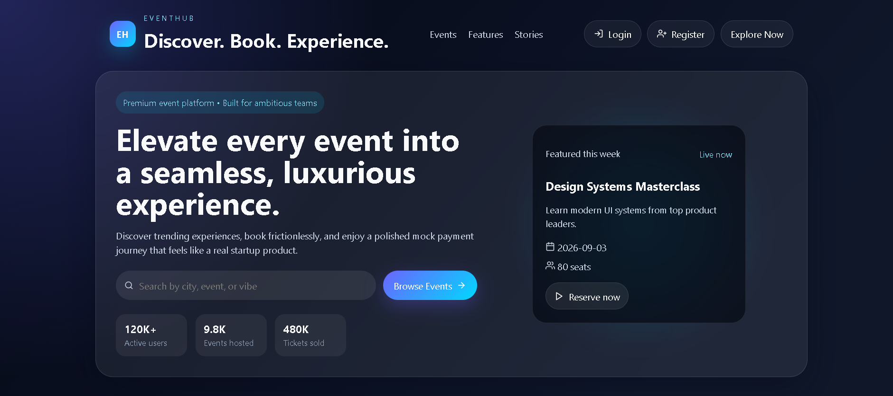
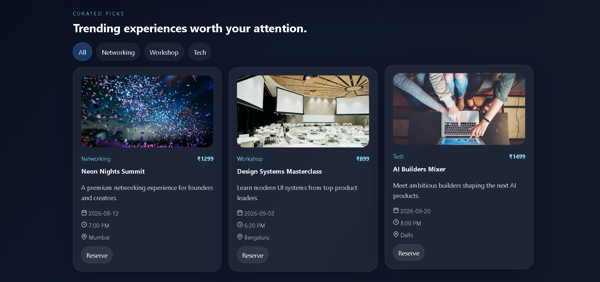
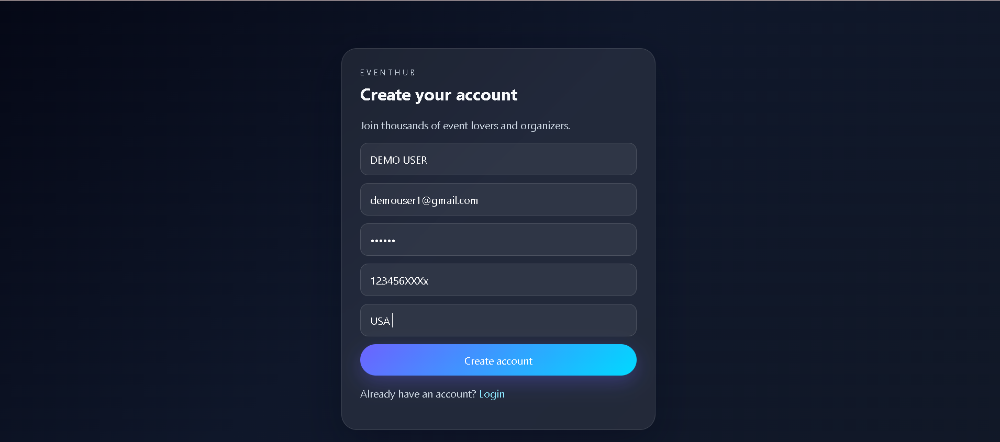
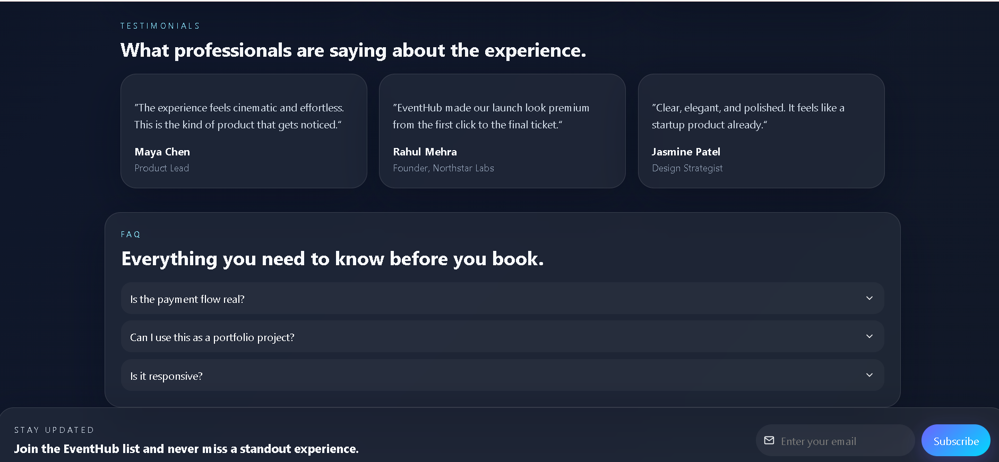

# 🎟️ EventHub

<div align="center">

**A modern full-stack event management platform** — discover events, book tickets, and manage everything through a polished, SaaS-style experience.

[](https://react.dev/)
[](https://nodejs.org/)
[](https://www.mongodb.com/)
[](https://tailwindcss.com/)
[](https://vitejs.dev/)

[Live Demo](#) · [Report Bug](https://github.com/Manikumar7-coder/EVENT-HUB/issues) · [Request Feature](https://github.com/Manikumar7-coder/EVENT-HUB/issues)

</div>

---

## 📸 Preview

<!--
  Add real screenshots here! In your repo, create a folder called
  frontend/src/assets/screenshots (or docs/screenshots) and drop your
  images there, then update the paths below, e.g.:
  
-->

| Landing Page | Event Discovery |
|---|---|
|  |  |

| Register Page | Testimonials |
|---|---|
|  |  |

---

## ✨ Features

- 🎨 **Stunning landing page** — animated hero, live search, featured event cards
- 🔍 **Smart event discovery** — search and filter by category
- 💳 **Simulated Razorpay checkout** — realistic payment flow for demo purposes
- 🎫 **QR ticket generation** — instantly generated, scannable tickets on booking
- 📱 **Fully responsive UI** — glassmorphism + gradient design system, mobile to desktop
- 🔐 **JWT authentication** — secure signup/login with bcrypt password hashing
- 🗄️ **MongoDB-backed APIs** — persistent events, bookings, payments, and reviews

---

## 🛠️ Tech Stack

**Frontend**
`React 19` · `Vite` · `Tailwind CSS 4` · `Framer Motion` · `React Router` · `Axios` · `Chart.js` · `React Hook Form`

**Backend**
`Node.js` · `Express` · `MongoDB` · `Mongoose` · `JWT` · `bcrypt`

---

## 🚀 Getting Started

### Prerequisites
- Node.js 18+
- MongoDB running locally or a MongoDB Atlas connection string

### Frontend
```bash
cd frontend
npm install
npm run dev
```

### Backend
```bash
cd backend
npm install
npm run dev
```

### Environment Variables
Create a `backend/.env` file (use `.env.example` as a template):
```env
PORT=5000
MONGO_URI=mongodb://127.0.0.1:27017/eventhub
JWT_SECRET=your_jwt_secret_here
CLIENT_URL=http://localhost:5173
```

> ⚠️ Never commit your real `.env` file — it's already excluded via `.gitignore`.

---

## 📁 Folder Structure

```
EVENT-HUB/
├── frontend/
│   └── src/            # React screens, components, and reusable UI
├── backend/
│   └── src/
│       ├── models/      # Mongoose schemas
│       ├── routes/      # Express route definitions
│       ├── middleware/  # Auth & error-handling middleware
│       └── server.js    # App entry point
└── README.md
```

---

## 🗺️ Roadmap

- [ ] Cloudinary image uploads
- [ ] Real payment gateway integration (Razorpay live mode)
- [ ] Organizer and admin dashboards
- [ ] QR ticket download and email confirmations

---

## 🤝 Contributing

Contributions, issues, and feature requests are welcome! Feel free to check the [issues page](../../issues).

## 📄 License

This project is open source and available under the [MIT License](LICENSE).

---

<div align="center">
Made with ❤️ by <a href="https://github.com/Manikumar7-coder">Mani Kumar</a>
</div>
